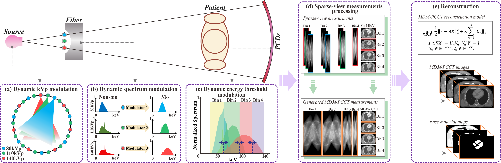

# **MDM-PCCT: Multiple Dynamic Modulations for High-Performance Spectral PCCT Imaging**

**Abstract:**

Photon counting computed tomography (PCCT) has the ability to identify individual photons, resulting in quantitative material identification. 
Meanwhile, several technical challenges still exist in current PCCT imaging systems, including increased noise and suboptimal bin selection. 
These nonideal effects can substantially degrade the reconstruction performance and material estimation accuracy. 
To address these issues, in this work, we present a novel system for high-performance spectral PCCT imaging, which is a combination of multiple dynamic modulations, 
interpolation-based measurements processing strategy and advanced reconstruction method. For simplicity, this new PCCT imaging system is referred to as "MDM-PCCT". 
Specifically, the multiple dynamic modulations consist of dynamic kVp modulation, dynamic spectrum modulation and dynamic energy threshold modulation. 
In the dynamic kVp modulation, three kVp values, i.e., 80, 110 and 140, are included, and the tube voltage waveform follows a sinusoidal curve which is more practical 
than the rectangular curve in the fast kV switching mode. 
In the dynamic spectrum modulation, the X-ray spectra are processed by selective spatial-spectral filters to balance the X-ray fluxes and increase the spectral separation. 
In the dynamic energy threshold modulation, the energy threshold is adaptively changed to determine the optimal bin selection. 
Furthermore, we propose an energy threshold determination method and interpolation-based measurements processing strategy to address the issue of non-uniform and sparse-view PCCT measurements, respectively. 
In addition, by considering the intrinsic characteristics of the MDM-PCCT images, we utilize an enhanced total variation regularized model for images reconstruction. 
Finally, numerical and preclinical studies demonstrate that the presented MDM-PCCT imaging system is capable of yielding uniform and high-fidelity PCCT measurements 
with noise consistency, and the presented reconstruction method further improves the image quality and material decomposition accuracy.

In summary, the presented MDM-PCCT imaging system makes four contributions:
* We first present the MDM-PCCT imaging system, which comprehensively considers dynamic kVp modulation, dynamic spectrum modulation 
and dynamic energy threshold modulation to balance X-ray fluxes, increase spectral separation and optimize bins selection.
* We investigate an energy threshold determination method to address the issue of nonuniform PCCT measurements, and propose to 
nterpolate the sparse-view measurements to suppress artifacts.
* We also present an enhanced total variation regularized model for MDM-PCCT image reconstruction by considering the intrinsic characteristics 
of the MDM-PCCT images to achieve satisfying results.
* The gains of the presented MDM-PCCT imaging system are extensively validated and evaluated with numerical and preclinical studies. 
The experimental results demonstrate the promising performance of the presented techniques for PCCT imaging.

Click [here](https://doi.org/10.1109/TMI.2020.3001616) to link to IEEE.